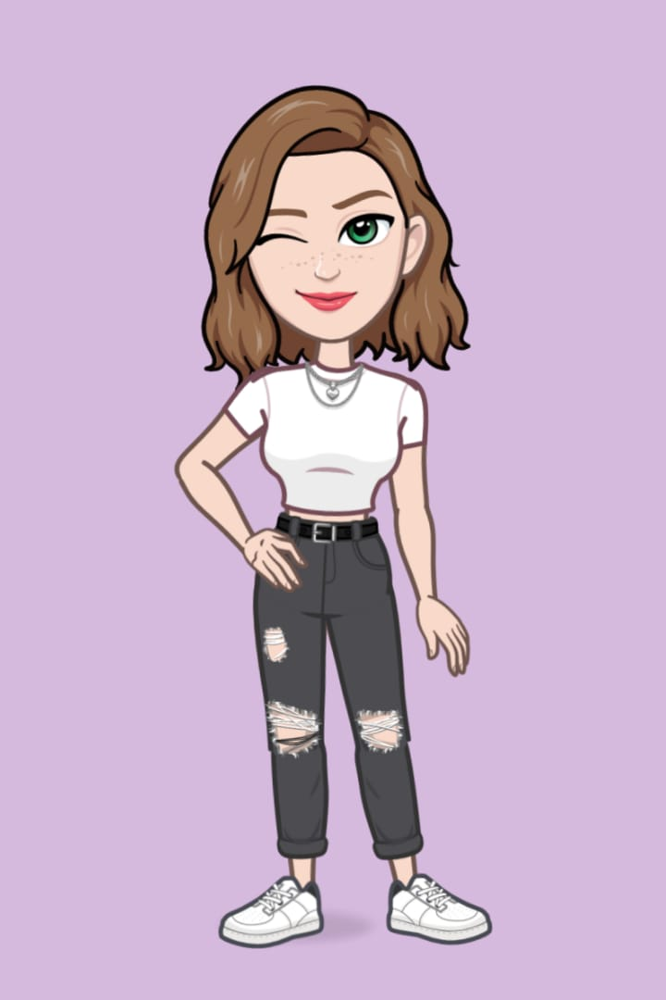

## Olá! Sou a Fabiele e bem vindo(a) ao meu Github! 👩‍💻

 
  

- 📚 Estudando Flutter 
- 💻 Interesse em trabalhar com Frontend
- 🎨 Gosto de criar widgets e telas para aplicativos 
- 💡 Diariamente em contato com conteúdos relacionados a tecnologia

##

  <a href="https://github.com/fabielehoerlle">
  
  

  
  ##
  

 
  
  

  
   
   
  

 
   
  
    

